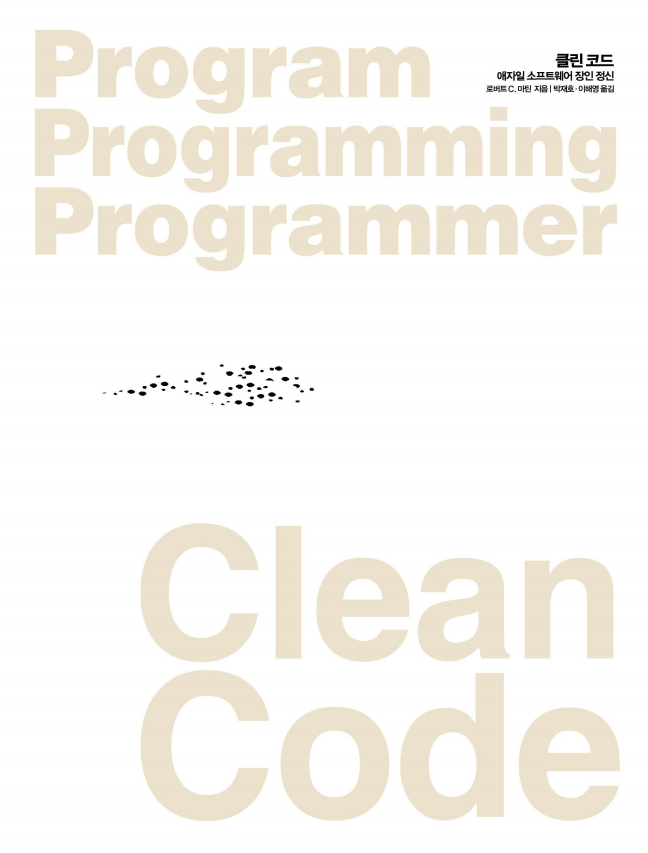

## 목차

- [독서 챌린지를 시작한 까닭](#독서-챌린지를-시작한-까닭)

***

## 독서 챌린지를 시작한 까닭

개발자로서 각자 공부를 하거나, 프로젝트를 진행하면 분명 와 하며, 해결하였던 문제들도 나중에 돌이켜 보았을 땐, 왜 코드를 이렇게 짰지 했던 경험이 있었던 것 같다.

당장의 문제를 해결하기 위한 것이었던 것 같기도 하였고, 돌이켜 보았을 때, 나 자신이 작성하였던 코드지만, 더럽다 라는 느낌을 받기도 하였다.

직접 작성하고도 그리 느낀다면, 남들이 보면 더 그런 느낌이 와닿지 않을까 고민이 들었던 것 같다.

이러한 코드는 한 번 길을 바로 잡지 않으면, 하던 작업이 점점 커질 수록, 스파게티 코드를 만드는 원인이 되지 않을까 고민을 하였고,

마침, 타이밍 좋게 찾은 하루 읽은 내용을 정리하고, 기재하는 북클럽에 대해 알게 되었다.

작심삼일이란 말이 있듯이, 혼자라면 이 정도면 되지 않았을까 하던 것도, 꾸준히 무언가를 정리하며 기재하는 습관을 들이다 보면, 완독을 이루고, 
선례들을 통해 코딩의 방향표를 다시 한 번 정립할 수 있기를 바라는 마음이다.

## 클린코드 책

***

## 해시태그 ##
#코딩 #개발자  #노마드코더 #북클럽 #노개북

***

## 작성시기 ##
2022.04.22

***